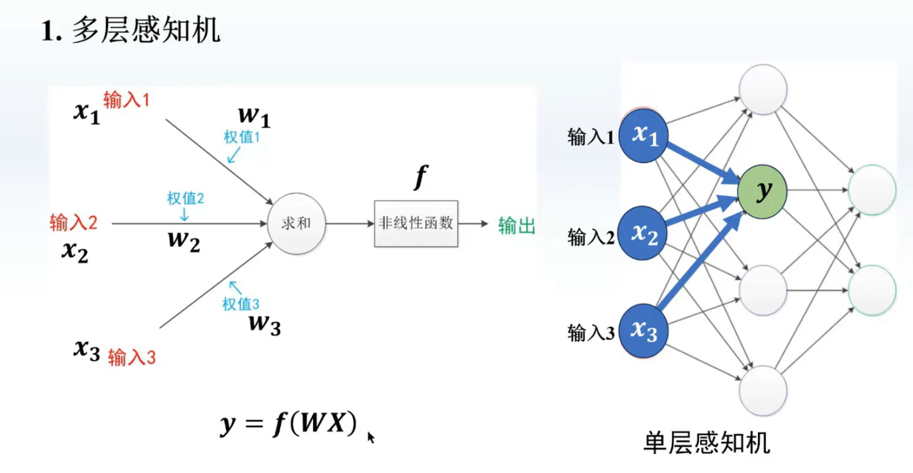
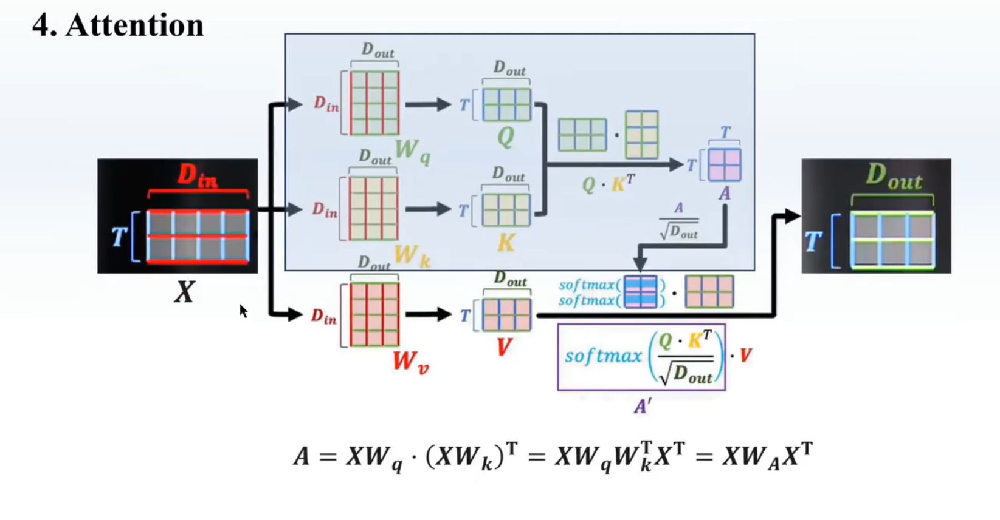

# Machine Learning

## 1. 机器学习

### 基础知识

#### 机器学习的分类

监督学习：有标注的数据 <==> 函数逼近

- 回归：拟合一个函数使得 y = f(x)
- 分类：拟合 y = f(x) 区别只在于数据类型不一样（比如图片数据是一堆像素/3维张量）
- 神经网络：也是拟合 y = f(x) <==> **函数的神经隐式表达**
- 函数逼近（Function Approximation）与函数拟合（Function Fitting）的区别：逼近通常关注的是函数在整个定义域上的表现，而不仅仅是已知数据点；逼近的目标是让简单函数在整体上尽可能接近目标函数。拟合的目标是让模型在已知数据上表现良好。
- 训练一个神经网路，就是在进行系统的参数辨识

非监督学习：没有标注 <==>

强化学习：用奖励函数引导 <==> 优化 + 随机

### 基础模型

#### MLP(Mutilayer Perceptrons)


$$
y=f(w_1x_1+w_2x_2+w_3x_3) --> y = f(WX)
$$


误差反向传播：(y-y^)W1 --> 误差从最后一层向前传播了一层 --> 每多一层，都会继续反向传播

> 梯度爆炸与消失：后面的导数累乘。详见3.反向传播

**ResNet(Residual Neural Network)**


- 残差块可**绕过多层激活函数**直接向前传播误差（解决了梯度消失的问题）
- 举例：NeRF

#### CNN

$$
y = f(WX)
$$

- W: 卷积和。跟上面的**全连接层完全一样**，只是训练的参数是卷积和而已。
- 卷积&池化：矩阵到矩阵的映射
- 池化：没有任何参数，无需训练，目的是改变维度（降维）
- 举例：AlexNet, GoogLeNet （都是 卷积+池化+全连接层/MLP）

反卷积 (Transposed Convolution)

- 一种特殊的正向卷积，先按照一定的比例通过补0来扩大输入图像的尺寸，接着旋转卷积核，再进行正向卷积。
- U-Net

#### RNN


神经网络的结构相同，但是每一时刻的隐藏层之间用系数S连接

> 详见 10.RNN

**LSTM**


之前的RNN每一步只取决于上一步的状态（记忆短），现在增加 C（用来记住之前的信息）


**Embedding**


潜空间：是分词器，one-hot 这2种表达方式的一个折中。

#### Attention

注意力意味着权值，其实是一种 super max 版卷积


获得注意力得分 -> 用注意力得分对向量进行变换

> 详见11.1 NLP-Transformer



- 当数据量比较小，CNN 优于 Attention；反之，相反
- 并行性上，Attention 优于 RNN

#### GNN

只是把图变成了矩阵，然后在上面做神经网络

- GCN (Graph Convolutional Networks) 
- GAT (Graph Attention Networks)
- Graph LSTM

### 小技巧

- 避免过度训练：随着训练轮次增加，训练集上的 loss 会不断减少。但是测试集上的 loss 会到达拐点后增加（过拟合）
- 定期存盘：防止模型训练中程序崩溃造成已训练的数据丢失
- Visdom：可以创建 web 服务，实时绘图

## 2. 梯度下降算法

### 基本概念

#### cost function（成本函数）

**作用**：计算**整个数据集**的平均误差。

**定义**：所有样本的损失函数的平均值或总和，用于优化整个模型。

**示例**：

- 如果使用均方误差（MSE）作为损失函数，那么成本函数就是所有样本损失的平均值： 

$$
\text{Cost} = \frac{1}{N} \sum_{i=1}^{N} (y_{\text{true},i} - y_{\text{pred},i})^2
$$

#### loss function（损失函数）

**作用**：计算**单个样本**的误差。

**定义**：衡量模型对单个训练样本的预测与真实值之间的差距。

**示例**：

- 对于回归问题，常见的损失函数： 

$$
\text{Loss} = (y_{\text{true}} - y_{\text{pred}})^2
$$

- 对于分类问题，如交叉熵损失： 
  $$
  \text{Loss} = - \sum y_{\text{true}} \log(y_{\text{pred}})
  $$

### 梯度下降

- 通过向梯度下降方向进行迭代 -> cost 最低
- 
- 对于训练集，如果收敛，cost 一定是不会上升的；反之出现上升，代表训练失败（最常见的原因：学习率α取得太大）
- 

### 随机梯度下降

- 
- 遇到鞍点，通过1个样本中的随机噪声推动训练继续向前，可能跨越过鞍点
- 

### 2种不同下降算法的优劣

#### 并行计算

梯度下降中，对于每一个样本，f(xi) 与 f(xi+1) 没有依赖关系。随机梯度下降中，2个样本之间是有依赖关系的，所以不能并行计算。

#### 折中方案

采用 Mini-Batch


## 3. 反向传播

### 2层神经网络的问题

- **引入非线性**：如果没有激活函数，神经网络无论有多少层，都只能表示线性变换，无法学习复杂的非线性关系。
- **决定神经元输出**：激活函数将输入信号转换为输出信号，决定神经元是否被激活（即是否传递信号）。
  - **激活函数**：将加权和 z 输入到激活函数 f 中，得到神经元的输出 a
  - **传递信号**：输出 a 会作为下一层神经元的输入。
  - Sigmoid 函数将信号压缩到 0 到 1 之间，适合表示概率。
  - ReLU 函数只传递正信号，抑制负信号（神经元不会被激活）。


### 反向传播

#### MLP(multilayer perceptron)

单层


双层


- (y - y^) W1 就是误差反向传播，本来的误差是 y - y^，*W1后传递到了前一层


#### 梯度爆炸与消失


每多一层，梯度项就多一个导数

- 如果该项>1，则爆炸
- [0, 1]，则消失

## 4. Pytorch实现线性回归

### 4步


**Design model**

构造计算图；

- 注意：torch中的变量(tensor等)会构建一个*计算图*（computational graph）， 来跟踪计算是哪些数据通过哪些操作组合起来产生输出，从而加速求导。表达式，函数，模型这些都属于计算图。

通过 x, y 的维度来确定 w, b 的维度

**Training cycle**

- forward: 算损失
- backward: 算梯度
- update: 更新权重

### Design model using Class

Our model class should be inherit from **nn.Module**, which is Base class for all neural network modules.

```python
class LinearModel (torch.nn.Module):
    def __init__ (self):
        # 调用父类的 init
        super (LinearModel, self).__init__ ()
        # 构造 linear 对象，包含 2 member Tensors: weight, bias
        self.linear = torch.nn.Linear(1,1)
        
    def forward(self, x):
        """
        Class nn.Linear has implemented the magic method __call__()，which enable the instance of the class can be called just like a function. Normally the forward() will be called. Pythonic!!!
        """
        y_pred = self.linear(x)
        return y_pred
    
    # backward 由 Module 自动实现了
    
model = LinearModel ()
```

### Construct loss and optimizer

```python
# size_average: 求均值（可求可不求，常数项一般没影响）
criterion = torch.nn.MSELoss (size_average=False)
# 通过 parameters (即model所有权重) 告诉优化器。lr: learning rate
optimizer = torch.optim.SGD (model.parameters(), lr=0.01)
```

### Training cycle

```python
for epoch in range (100):
    y_pred = model(x_data)
    loss = criterion(y_pred, y_data)
    # loss 在 print 会自动调用 __str__()
    print (epoch,loss)
    
    # The grad computed by backward will be accumulated. So before backward,remember set the grad to ZERO!!!
    optimizer.zero_grad()
    loss.backward()
    # step() -> update
    optimizer.step()
```

### Print

```python
# Output weight and bias. weight is a matrix, use item() to print numbers
print('w =', model.linear.weight.item())
print('b =', model.linear.bias.item())

# Test Model
x_test = torch.Tensor ([[4.0]])
y_test = model(x_test)
print ('y pred =', y_test.data)
```

### 🧠 什么是 `Dropout`？

**Dropout（丢弃法）** 是一种神经网络常用的**正则化技术**，目的是防止模型过拟合。

- **作用原理**：在训练过程中，神经网络的某些神经元会被**随机“关闭”**（即设置为 0）。
- 比如，一个隐藏层有 100 个神经元，设置 Dropout=0.5，那每次训练时会**随机关闭一半**的神经元。

这样做的好处是：

> 网络不能依赖某几个特定神经元，必须学会更“健壮”的表达方式，从而提高泛化能力。

### 🤖 `model.train()` 做了什么？

当你调用：

```python
model.train()
```

这会让模型进入**训练模式**，有两个核心行为：

1. 启用 Dropout（如果模型中用了 `nn.Dropout`）
2. 启用 BatchNorm 的训练行为（比如使用 mini-batch 的均值和方差）

也就是说：

✅ 在 `model.train()` 下，Dropout 会随机丢弃部分神经元。

### 📌 相对地：`model.eval()` 做了什么？

当你调用：

```python
model.eval()
```

模型进入**评估模式**，这个时候：

- Dropout 会被**关闭**（即所有神经元都工作）
- BatchNorm 使用的是**训练中记录的全局均值/方差**，而不是当前 batch 的。

也就是说：

✅ 在 `model.eval()` 下，模型会**稳定输出**，不会有随机行为，更适合评估性能或预测。

## 5. Logistic Regression (分类)

- y 属于 R (连续) -> 回归任务
- y 属于 集合 -> 分类 (输出的是概率，满足某个分布)

### Logistic Function

$$
\sigma(x)=\left(\frac1{1+e^{-x}}\right)
$$

- 是一种饱和函数：导数的形状满足两头趋近于0 (类似于正态分布的分布函数的形状) 

### Sigmoid function


- Logistic function 也属于 Sigmoid function

### Logistic Function Model


### 实现 Logistic Regression


## 6. 处理多维特征的输入


### Mini-Batch (N samples)


- 转化成 tensor 的形式 (利用 GPU/CPU 并行计算的能力)

### Define Model


## 7. 加载数据集

### Terminology

**Epoch:** One forward pass and one backward pass of **all the training examples**.

```python
# Training cycle
for epoch in range(training_epochs):
    # Loop over all batches
    for i in range(total_batch):
```

**Batch-Size:** **The number of training examples** in one forward backward pass.

**Iteration:** Number of passes, each pass using **batch size** number of examples.

### DataLoader

**shuffle:** 把数据集打乱顺序，使得每次 epoch 生成的 Mini-Batch 不一样。 

### Code

```python
import torch
# Dataset is an abstract class.We can define our class inherited from this class.
from torch.utils.data import Dataset
from torch.utils.data import DataLoader

# (Dataset) 表示继承
class DiabetesDataset (Dataset):
    def __init__ (self):
        pass
    
    # __getitem__ 方法根据索引返回数据集中的一个样本（通常是特征和标签的组合）
    def __getitem__ (self, index):
        pass
    
    # __len__ 方法返回数据集的大小（即样本的数量）
    def __len__ (self):
        pass

dataset = DiabetesDataset ()
# num_workers 使用并行进程读取数据
train_loader = DataLoader (dataset=dataset, batch_size=32, shuffle=True, num_workers=2)
```

## 8. 多分类问题

We hope the outputs is competitive! Actually we hope the neural network outputs is a **distribution**.

### With Softmax


Suppose Z is the output of the last linear layer, the Softmax function:
$$
P(y=i)=\frac{e^{z_i}}{\sum_{j=0}^{K-1}e^{z_j}},i\in\{0,...,K-1\}
$$

### CrossEntropyLoss vs NLLLoSS


| 特性               | CrossEntropyLoss           | NLLLoss(Negative Log Likelihood Loss) |
| ------------------ | -------------------------- | ------------------------------------- |
| 输入               | 原始 logits                | 对数概率（log-softmax 之后的值）      |
| 需要 log_softmax？ | **不需要**，内部会自动计算 | **需要**，需手动调用 `log_softmax`    |
| 适用场景           | 直接用于分类任务           | 适用于已经计算了 log-softmax 的情况   |

**总结：**

- `CrossEntropyLoss = log_softmax + NLLLoss`，可以理解为 `CrossEntropyLoss` 是 `NLLLoss` 的封装版。
- **一般情况下，建议使用 `CrossEntropyLoss`，因为它更方便，不需要手动计算 `log_softmax`**。
- `NLLLoss` 适用于某些自定义模型或已经预处理好 log 概率的情况。

## 9. CNN


构建神经网络要明确：input, output 的张量维度


### Subsampling


### 利用 GPU 训练

```python
device = torch.device("cuda:0"if torch.cuda.is_available() else "cpu")
model.to(device)

def train(epoch):
    for batch_idx, data in enumerate(train_loader, 0):
        # send the inputs and targets to the same GPU
        inputs, target = inputs.to(device), target.to(device)
```

## 10. RNN

### 10.1 RNN 的权重共享机制

在标准 RNN 结构中，假设输入序列为 x1,x2,…,xT，对应的隐藏状态为 h1,h2,…,hT，输出为 y1,y2,…,yT。RNN 的基本计算公式如下：
$$
h_t = f(W_h h_{t-1} + W_x x_t + b_h)\\y_t = g(W_y h_t + b_y)
$$
其中：

- Wx 是输入到隐藏层的权重矩阵；
- Wh 是隐藏层的自循环权重矩阵；
- Wy 是隐藏层到输出的权重矩阵；
- bh 和 by 分别是隐藏层和输出层的偏置；
- f(⋅) 是激活函数（如 tanh⁡ 或 ReLU）；
- g(⋅) 是输出映射（如 softmax）。

在 **整个序列的时间步**（t=1,2,…,T）中：

- **Wx,Wh,Wy,bh,by 在所有时间步中都是相同的**（即**共享**），无论输入序列长度如何，RNN 在不同时间步都使用相同的参数。

### 10.2 RNN 共享权重和偏置的主要原因

#### (1) 使模型可以处理不同长度的序列

- 在 NLP、时间序列预测等任务中，输入序列的长度 T 可能是不固定的。例如，一句话可能是 5 个词，也可能是 15 个词；一段时间序列可能是 10 个时间步，也可能是 1000 个时间步。
- 由于 **每个时间步使用相同的权重 Wx,Wh,Wy**，RNN 能够处理不同长度的输入序列，而不需要重新设计或调整网络结构。

#### (2) 提高参数共享性，减少训练参数数量

- 如果每个时间步 t 都使用不同的权重 Wt，那么对于长度为 T 的序列，需要 T 组不同的参数，导致参数数量急剧增加，训练和存储的成本会大幅上升。
- 共享权重后，RNN 只需学习 **固定的一组参数**，无论序列多长都能使用，极大减少了参数数量，使得**训练更稳定，泛化能力更强**。

#### (3) 使模型具有时序结构的学习能力

- 由于共享权重，RNN 在每个时间步都使用相同的变换方式，这种**递归结构**让网络可以学习到时间步之间的依赖关系，如短期和长期的依赖模式。

RNN 专门处理带有序列模式的数据，通过权重共享来减少需要训练的权重数量


h: hidden


```python
"""
prepare dataset
"""
import torch
input_size = 4
hidden_size = 4
batch_size = 1

# dictionary
idx2char=['e', 'h', '1', '0']
x_data=[1,0,2,2,3]
y_data=[3,1,2,3,2]

# convert indices into one-hot vector
one_hot_lookup = [[1,0,0,0],
[0,1,0,0],
[0,0,1,0],
[0,0,0,1]]
# seg * input_size
x_one_hot = [one_hot_lookup[x] for x in x_data]

# Reshape the inputs to(seqLen,batchSize,inputSize)
inputs torch.Tensor (x_one_hot).view (-1,batch_size,input_size)
# Reshape the labels to(seqLen,1)
labels torch.LongTensor (y_data).view (-1,1)

"""
design model
"""
class Model (torch.nn.Module):
    def __init__ (self,input size,hidden size,batch size):
        super(Model,self).__init__()
        self.num_layers = num_layers
        self.batch_size = batch_size
        self.input_size = input_size
        self.hidden_size = hidden_size
        # Shape of inputs(batchSize,inputSize); Shape of hidden:(batchSize,hiddenSize)
        self.rnncell = torch.nn.RNN (input_size=self.input_size, hidden size=self.hidden_size, num_layaers=num_layers )
        
    def forward (self,input):
        hidden = torch.zeros (self.num_layers, self.batch_size, self.hidden_size)
        out, _ =self.rnn(input,hidden)
        return out.view (-1, self.hidden_size)

net = Model(input_size, hidden_size, batch_size, num_layers)

"""
loss and optimizer
"""

criterion = torch.nn.CrossEntropyLoss()
optimizer = torch.optim.Adam (net.parameters(), lr=0.05)

"""
training
"""
for epoch in range(15):
    # 梯度先清零！
    optimizer.zero_grad()
    outputs = net(inputs)
    # 不要用 item，需要构建计算图
    loss = criterion (outputs, labels)
    loss.backward()
    optimizer.step()
    
    _, idx = hidden.max (dim=1)
    idx = idx.data.numpy ()
    print('Predicted:'''join([idx2char[x]for x in idx]),end='')
    print(',Epoch [%d/15]loss =%3f'%(epoch +1,loss.item()))
```


## 11. Learning的过去十年

**CV-CNN**

`2012-AlexNet, 2015-ResNet`

**NLP-Transformer**

`2017-Transformer, 2018-GPT, 2018-BERT, 2019-GPT2, 2020-GPT3`

**CV-Tranformer**

`2020-ViT, 2021-Swin Transformer, 2021-MAE`

**多模态**

`2021-CLIP, 2021-ViLT`

**生成模型**

`2014-GAN, 2020-DDPM, 2022-DALL.E2`

### NLP-Transformer

#### 特征假说


- 在数据量充足的情况下，特征的维度越高，能保留的原始信息就越多
- 原始维度能保留的信息最多

CNN与RNN的缺陷：视野范围有限，能掌握的全局信息很少

- RNN：x1 的信息要等很久才能传到 x4
- CNN：第一个像素的信息也要等很久才能与最后一个像素的信息卷积到一起

#### Attention


- 每个向量跟所有其他向量是全连接，得到新的一层，这一层跟原始向量是同一维度


#### Transformer


- Positional Encoding: 在原来特征的基础上 + position embeddings -> 不改变原有向量的维度
  - 加上后能得到位置上的信息 -> 不同位置的词的含义不一样，从而能区分
  - 原有的维度足够高 -> 不会因为加上了位置编码改变原有的特征

优势：

- 方便进行大规模并行运算
- 每层不改变输入输出维度
- 丰富的可学习参数（参数不够就叠，先天大模型圣体）

#### GPT

- GTP-1：Improving Language Understanding by Generative Pre-Training
- GPT-2：Language Models are Unsupervised Multitask Learners
- GPT-3：Language Models are Few-Shot Learners

**GPT-1**

1.  迁移学习，预训练基础模型，微调在下游任务上
2.  如何在没有标注的数据集上进行训练（模型：Transformer的**Decoder**）

$$
\text{最大化似然函数}\quad L_1(\mathcal{U})=\sum_i\log P(u_i|u_{i-k},\ldots,u_{i-1};\Theta)\\\text{cmt: 目标是通过调整参数 Θ 使模型对数据 U 的预测概率最大化的过程，视野范围是k}
$$

3.  如何在有标注的数据集上进行微调，用于下游任务

$$
\text{给定}m\text{长度的序列预测标号}y\quad P(y|x^{1},\ldots,x^{m})=\text{softmax}(h_{l}^{m}W_{y})\\\text{最大化分类目标函数函数}\quad L_{2}(\mathcal{C})=\sum_{(x,y)}\log P(y|x^{1},\ldots,x^{m})\\\text{最大化似然函数}\quad L_{3}(\mathcal{C})=L_{2}(\mathcal{C})+\lambda*L_{1}(\mathcal{C})
$$

- 滑动窗口在数据局部性分析、降低计算复杂度、平滑数据、适应动态变化等方面有作用


#### BERT

将预训练的语言表示应用于下游任务：

- feature-based:如ELMo(基于RNN,利用双向的信息)
- fine-tuning:如GPT(基于Transformer,利用单向的信息)

BERT：基于Transformer的**Encoder**，利用**双向信息**，预训练的语言模型

### LLM


### Diffusion

#### Algorithms


其中的玄机：

1. Trainning中的加noise与 denoise 实际上并不是一步一步进行的，而是一次完成，这样是因为多次采样的 noise 与1次采样的 noise 乘上参数后，数学上是等价的。
2. 为什么denoise后还加上了 noise z? 从GPT以及语音生成模型中可以发现，需要这样一个随机性，否则效果不好（人类的写作也是存在随机性的，下一个词并不都是概率最大的那一个）

#### Framework of Text2Image


## 12. 科研之路

- 在**难以获得的数据集**上训练，不建议在玩烂了的数据集上卷
- 直接使用预训练好的模型，作为自己方法中的一部分
- 用简单基础的神经网络替换传统方法中非学习的部分
- 将复杂网络中的模块替换为轻量化的模块

### 12.0 请教xzp yww

#### xzp

Q: 现在确定是搞时序预测这个方向，但是现在不知道哪个细分方向值得做，所以不清楚应该看哪些文章?

A: 时序的话其实yww做得多一些，我只做了概率时序预测这个方向，这个方向可能入门会偏难一些，如果你能把**数理基础打好一些**，像是NsDiff能弄懂，那**概率时序预测**这个方向还是有很多东西可以做的。但是如果去做**纯时序**因为没什么理论大家都在讲故事搞模型，就会很卷，不过**入门偏简单可以快速上手**。

Q: 我想冲明年的ICML，但不清楚应该在哪些方面做准备?

A: 像是ICML还是有难度的，这个是三大会里比较偏好理论的，做的东西理论扎实会比较有优势。假如你想搞概率时序这个方向，且想冲明年ICML，建议尽快把diffusion这些基础弄懂，然后也**把我们的那个NsDiff+里面的baseline论文看懂，然后再在这个基础上思考自己的idea**。如果上述都弄得很懂且有自己的理解了，也可以去了解一下SDE视角下的diffusion，可能可以找到别人的一些新理论直接魔改用在时序上，这部分就是比较进阶且比较难了。

A: 光有理论也不行，实验设计和故事也得搞好，不过这些桂老师还能指导一下，理论只能靠自己了。如果没有理论也不是不能发ICML，把故事和实验搞好也是有机会的。叶师兄可能会给你其它一些具体的做时序思路，走我刚刚说的那条路可能偏困难，如果一直搞不定可能反而拖慢了后续的科研节奏，不要勉强，搞科研搞点水一点的文章碰碰运气也不是不行，可能反而对后续读博和工作更有利。

#### yww

Q: 我计划研一要完成第一次投稿，上次跟许哥交流了一下，当时问他如果冲明年的ICML，需要怎么准备？他推荐做概率时序预测这个方向，建议我先把 diffusion 这些基础弄懂，然后弄懂 NsDiff 和里面的 baseline，在此基础上思考自己的 idea。但同时他也强调说这条路可能偏困难，如果一直搞不定可能反而拖慢了后续的科研节奏，建议我找你请教其它一些具体做时序的思路。

A: 什么都很困难，先看懂再说，结合代码和之前的工作看，相关工作里的都跑跑看看。

Q: 跑代码的话，需要把论文里面的结果完全复现出来不？

A: 不用，重要的是看懂，不是复现。

A: 你如果想投的话就早点投一篇吧，icml战线拉太长了，随便写一篇投出去再说，我只能说多投多写，其他只能看你造化，没必要憋个大招。多看看文章，先想几个idea，挑一个觉得比较好的写就行了。

Q: 考虑到第一次就投ICML难度较大的话，推荐投什么？

A: 很多可以投呀，Aaai iclr ijcai icml Kdd Www，这些都比icml早。

Q: 还有一个，就是我平常看文章，经常容易看不懂里面的一些表达，但是去结合代码看的时候，就发现其实比较简单

A: 是这样的，还是多结合代码看吧，你看多了就不会这样了，没关系的，看多了就不会去看文章了，我现在就是这样。

Q: 对于文章里面的一些理论推导，需要完全理解不？

A: 看是什么文章，还有你敢不敢兴趣，很多时候要看都要花很多时间的。主要是对你有没有作用，对你有作用的话可以花时间，对你没作用，就不用花时间。

### 12.1 小姜的茶馆

#### 科研≥找坑+填坑

以“填坑”为目的的文献调研能够在一定程度上把motivations和contributions联系起来，但是和“找坑”过程带给研究者的insights一比，自然相形见绌了。

组会的内容也从单纯的“结果汇报-改进模型-再次汇报”变成了“动机分析-方法分析-结果汇报-模型改进”。简单地说，**做科研不仅限于刷榜，更是对一个研究问题的深度探讨和解决，而且对问题的分析很多时候能够帮助方法的迭代**。

以前，我以为学术界会更公平、更透明、更客观；后来我才发现，这世界都是草台班子，无赖在哪里都有，学术界的无赖甚至用知识武装了自己，比普通无赖更难缠。

#### 科研怎么搞？

**找坑：我想做什么？别人做了什么？我还能做什么？**

- **三个问题的解决顺序不是线性的**。很多时候，我们在一开始是不知道自己真正想做什么的，而是需要看看现在大家都做了些啥，然后才知道自己想做啥。就好像对多数想要学厨的新手来说，在创立自己的门派之前，至少得知道现在这个世界上有几大菜系吧？在有了初步了解之后，通常我们对自己的喜好也会有一个不那么模糊的认知了。对我自己而言，接下来就是一个iterative的过程，**不断地读文章、做总结，等待量变导致质变的那一刻**。
- **可行性和难度的trade-off要好好把握**。研究的类型有很多种，**incremental的是有价值的，groundbreaking的也是有价值的**，这很大程度上取决于每个人手里的资源。举个不太恰当的例子，大家都知道LLM很重要，而且有很多需要研究的东西。让个人研究者去从头训练一个GPT4量级的LLM听起来自然是ambitous的，但是可行性呢？这位个人研究者真的能像OpenAI一样“翻云覆雨”吗？仰望星空总是好的，但是我们也要脚踏实地呀。
- **多和前辈、同龄人交流**。这不是一句玩笑话，也不是场面话。随着遇到的大牛们越来越多，我逐渐意识到一个人眼界的局限性能有多可怕。有时候别人的一句话，很可能会帮助我少走一周的弯路。那这一周的时间，就能更自由的安排，不管是继续学习还是放松休息。

找坑方法：对于AI paper来说，把故事吹得天花乱坠是常态，但是只有提供代码，能复现的工作才真正值得我们花大力气研读。根据我有限的经验，**很多idea是在复现工作的时候出现的——很多“金矿”都是隐藏在跑实验的dirty work里**。所以，我通常会把领域相关的paper先快速扫一遍，看看现在大家都对什么问题感兴趣。通常这个过程只需要**把每篇文章的 objective 和 claim 理解即可**。然后对于那些可复现性高的工作，我会再额外花时间进行重点研究，争取复现出paper的性能。

找值得读的文章：

1. 有官方或第三方的开源代码库，且有一定的关注度。虽然很尴尬，但不得不承认，目前很多AI paper的代码写得并不整洁，跑这类代码很多时候是在为原作者debug，帮助有限。所以，最好能够找那些star比较多或者README写得很专业的repo来入手。这个需要一点点经验，但踩过两次雷应该就好了。
2. 有能力的话，建立一个自己的复现pipeline（流水线）。我们都知道，model只是ML pipeline中的一环，其他的data/evalutation等部分都是可以复用的。所以如果能够搭一个自己熟悉的pipeline，那么复现别人的工作真的就是在复现别人的模型，免去了很多的重复劳动。
3. 按倒序复现工作。通常时间越近的工作性能是越优秀的，它们很可能已经解决的再之前工作中的一些问题。站在巨人的肩膀上，能看得更远。尽可能少走一些弯路，少一些冗余动作。

填坑：我要怎么做？我做了有效吗？我怎么说服其他人？

- 解决方法不是一蹴而就的，很可能要反复迭代。在找坑的过程中，我们对现在工作的不足和局限性已经有了一定的了解，而且这些问题通常不是那么好解决的。这个时候我们可能会面临两种情况：（1）天选之子，问题的答案已经了然于胸了；（2）没啥头绪，我还要再练练级。从我个人的经验来说，后者出现的概率会更高一些。那该怎么练级呢？答案其实很朴素：继续读文献找思路。注意，这里的读和找坑时候的读不太一样，在填坑阶段的读里，“拿来主义”的色彩会更浓烈一些。换句话说，此时读文献是主要为了解决一个具体的问题，而不是发现一个问题。这样的文献其实读得更“无脑”，也是我第一段科研经历里读文献的真实写照。
- 三个问题的解决顺序不是线性的。我们提出的解决方法是通过实验结果来证明有效性的，这是客观因素。那好像自然的逻辑就是依次回答这三个问题——但残酷的是，好的结果不一定能说服其他人，现在的评审体系就是“好酒也怕巷子深”。想要说服大概率只花半个小时看我们文章的审稿人，就不得不写一些“shining words”抓住他们的注意力。换句话说，我们很多时候不得不给方法“编”一个引人入胜的故事。所以故事和方法是相互影响的：更好的方法通常能够支撑一个更好的故事，更好的故事也能让更多人相信我们提出的方法。
- 填坑可能会更新我们对坑本身的认知。换句话说，找坑和填坑的阶段并不是严格独立的。举个例子，在ProtoGate这篇工作中，我们一开始找到的坑是从模型精确度和特征选择稀疏度这两个角度出发的，但是在设计方法时，我们意识到可解释性，特别是co-adaptation problem，也是被之前方法忽略的一个重要问题。由此，我们进一步拓宽了之前发现的坑，丰富了我们这篇工作的motivation，进一步提高了方法的impact。

因为每个领域的算法设计思路千差万别，所以很难像找坑阶段一样列出较为通用的方法论。但对于和我一样偏engineering思维的朋友来说，**多跑实验绝对是一个值得推荐的选择**。

#### 文章怎么投稿？

投稿前

- Paper checklist：涵盖文章撰写过程中的修改要点，可能是自己的思维碎片，也可能是合作者的建议，重点在于提高文章的可读性并保证正确性。
- Format checklist：根据投稿venue的要求制定，通常在官网上的“Call for papers”板块都会有相应资源。

投稿中

- Revision summary：文章submit后不是结束，几乎肯定还会有不完善的地方需要修改，可能是实验内容、格式、图表等等，这些会很繁杂，最好把它们都记录下来。
- Anticipated questions：在rebuttal意见出来之前，可以大胆预测一下可能的问题，提前做好准备，手中有粮心不慌。
- Rebuttal：一个共享文档，便于和合作者一起修改。

投稿后

- Revision summary：根据审稿意见更新之前的summary，注意要做high-level的修改，就像debug要解决根本问题一样。
- Admission requirements：如果文章很幸运的中稿了，通常会有额外的camera ready instructions，逐条对照避免错漏即可。

### 12.2 从 idea 到写作

#### 小白阶段

1. 读最新的综述，建立起最基本的概念、公式、方法，找到一个方向（不要过烂的方向）
2. 根据方向，选20篇文章，先读5-10篇（最经典的、引用量最多、名校的最新工作）
3. 读的过程中要有：理论上的思考，实验的demo复现
4. 与师兄师姐讨论 --> 能否产生一些 idea
5. 再次读最新的文章，排除重复的 idea

**相关细节**

理论：一开始不可能把一个理论想的非常完美，脑子中应该有很多沾边的理论方向（可能是2-5个）--> 与高手讨论，筛掉完全不可能的 idea --> 剩下 1-2 个

实验：demo实验（简单尝试 idea 的可行性）--> 发现有一点结果，马上和老师、师兄汇报；没有结果，也汇报，讨论（如果结果比 baseline 好一点点也很好）


深入理论：看前沿论文，排除重复的 --> 找 A4 纸，完善理论体系（自己写 --> 给师兄看 --> 指出问题）

深入实验：大规模 benchmark 实验，遇到问题 --> 看前沿论文中的 trick，加进来；不断跟进消融实验，确保自己的 idea 能 work


边写论文，边跑实验

写之前先构思故事：有合理的 motivation，想 2-3 个故事逻辑，与师兄分享 --> 如果他们觉得有意思、逻辑合理，说明故事不错

论文写作顺序：Related work, Preliminary, Experiments(benchmark, alation study, other exps), Method(深入理论讨论的时候已经写好了), Introduction( Method, Introduction 应该按照故事逻辑展开), Abstract, Conclution, Limitation

具体撰写：找领域内的大佬论文（3篇左右，一作是外国人）--> 按段落摘抄（学逻辑和地道的英语表达）-->自己写的时候可以中英混合，英是前面的地道表达，然后谷歌翻译，GPT 润色

修改：让师兄/co-author 从审稿人的视角批判自己的文章，越狠越好 --> 自己改
